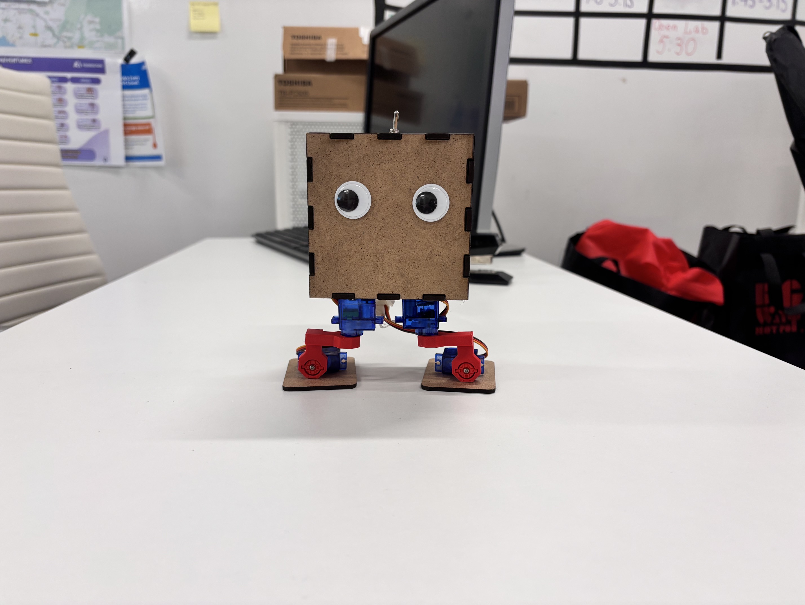
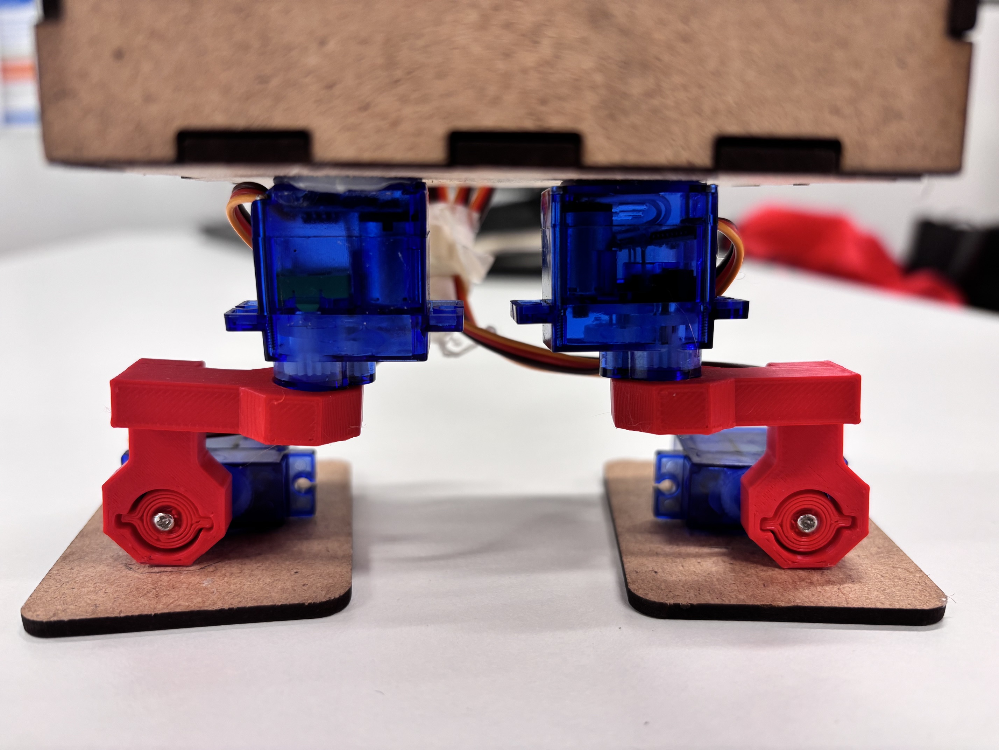
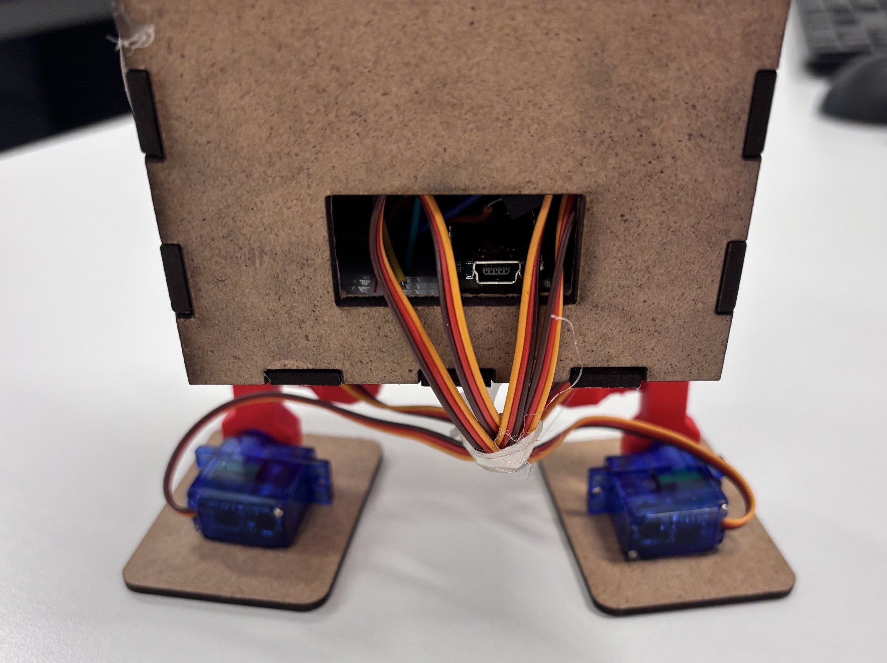
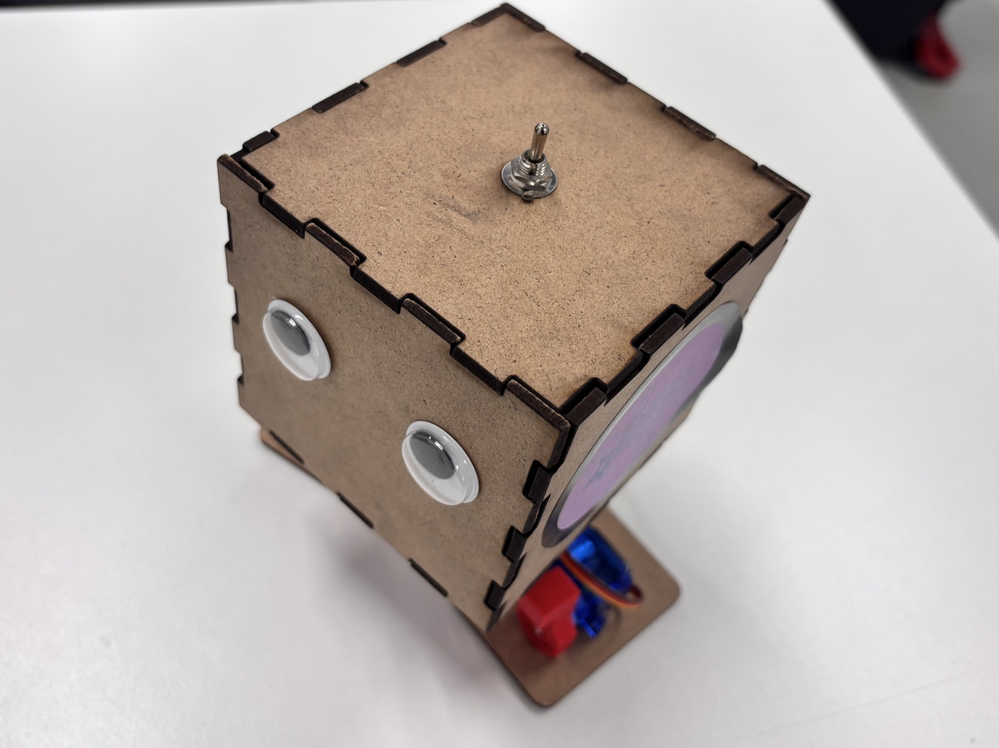

# WaddleBot
How to build a WaddleBot  
---

---
**Materials Needed**

* Frame (see WaddleBot-Body.svg)  
* Legs (see WaddleBot-Legs.stl)  
* 4x SG90 servo motors  
* 1x toggle switch  
* 1x small breadboard  
* 1x Arduino Nano  
* 1x 2s LiPo 7.4V 1200mAh battery  
* 1x 1000μf electrolytic capacitor  
* Jumper wires  
* Hot glue
---
**Step 1: Electronics**

Wire your electronics as shown in the wiring diagram. When wiring the servos, make sure to pass the wires through the back plate of the frame.

**Step 2: Legs**

Before attaching the legs, make sure the servos are in their center position. This so the legs have the maximum range of motion in both directions from their starting positions. Attach the servo leg attachments and screw them in place.

**Step 3: Body**

Glue the legs to the feet and the bottom-body piece as shown. The servos should be roughly centered on the feet. The Servos being attached to the bottom-body piece should be evenly spaced apart and placed slightly towards the front of the robot.

The Electronics can now be placed on top of the bottom-body piece and the side panels can be glued in place. **DO NOT** glue the top-body piece. It is important to place the Arduino so that its connection port is facing the opening on the back.

The toggle switch should be mounted through the hole on the top-body piece. It can then be placed on top and should remain unglued so that it can be removed to access the electronics.

**Step 4: Code**

Upload the code (Waddlebot-Code.ino) and watch the WaddleBot Waddle\!

*Note: When the WaddleBot gets turned on, It first sets the legs to their starting position before beginning to walk. You will likely need to adjust the starting positions in the code (int LT \= 90, RT \= 90, LF \= 90, RF \= 90;)*

